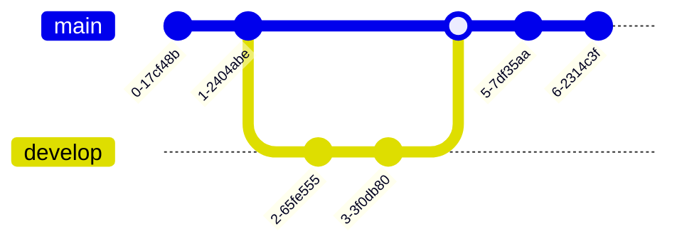

# 高级
## 自定义表题+ID
```markdown
# X {#x}
```

## 段落
Markdown里面的段落前面不能有超过一个空白字符（空格、制表符等）。 前面如果有超过一个空格或制表符，该行文本会被生成代码块`<pre><code>...</code></pre>`而不是段落`<p>...</p>`

段落后面也不能有超过一个空白字符（空格、换行符等）。 如果有超过一个换行符，会生成两个段落。如果有超过一个空格，会生成换行标签`<br/>`

## 换行
请在行尾添加多个空格或 HTML的`<br/>`标签来实现换行

## 

## 分割线
在使用分隔线时一行在分隔线的上下各留一行空白行
虽然星号、减号和下划线都能构成分隔符，但一般使用减号，输入更方便

## 超链接
```markdown
[Sex](Sex.com)
[Sex](./Sex)
<Sex.com>
<Sex@Sex>
[Sex](./Sex )
`Sex.com`

1. 这是一个[**粗体链接**](./粗体斜体删除线)
1. 这是一个[_斜体链接_](./粗体斜体删除线)
1. 这是一个[**_粗斜体链接_**](./粗体斜体删除线)
1. 这是一个[`在代码里面的链接`](./代码块)
```

## 图片
本地：
链接：[](/tools/)
标题：
大小：

## 支持内嵌HTML、CSS和JavaScript

## 表格

## 公式

## 图表
- 流程图

- 时序图

- 类图

- 状态图

- 实体关系图

- 用户旅行图

- 甘特图

- 需求图

- Git记录图

- C4模型图

## 注释
```html
<!-- 注释内容 -->
<?注释内容>
```